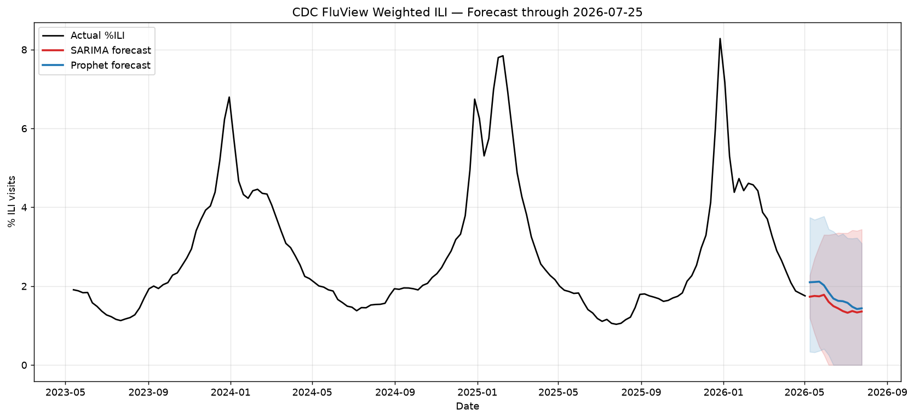

# 🤒 Flu Season Forecasting

Forecasts US weekly influenza-like illness (ILI) using CDC FluView data.
Pulls fresh data, retrains SARIMA + Prophet models, evaluates with walk-forward
cross-validation, and publishes interactive plots — all on a weekly cron via
GitHub Actions.



## Highlights

- **Real CDC data** via the [Delphi Epidata API](https://cmu-delphi.github.io/delphi-epidata/api/fluview.html) — no manual downloads
- **Two production models**: SARIMA (statsmodels) and Prophet, plus an optional simple LSTM
- **Honest evaluation**: rolling-origin walk-forward CV with MAE / RMSE / MAPE / 95 % interval coverage
- **STL decomposition** to inspect trend, seasonality, and residuals
- **Automated updates**: GitHub Actions cron runs every Friday after CDC's weekly release
- **Multiple display options**: static PNG, interactive Plotly HTML (deployable to GitHub Pages), Streamlit dashboard, Jupyter notebook

## Project layout

```
flu-forecast/
├── src/
│   ├── data_fetcher.py        # Delphi Epidata client + caching
│   ├── decomposition.py       # STL decomposition
│   ├── evaluation.py          # walk-forward CV + metrics
│   ├── forecast_pipeline.py   # end-to-end orchestrator
│   └── models/
│       ├── arima_model.py     # SARIMA wrapper + small grid search
│       ├── prophet_model.py   # Prophet wrapper
│       └── lstm_model.py      # optional Keras LSTM
├── notebooks/01_exploration.ipynb   # walkthrough of methods
├── dashboard/app.py           # Streamlit dashboard
├── .github/workflows/update-forecast.yml   # weekly cron + GitHub Pages
├── data/                      # cached CSV (auto-populated)
├── outputs/
│   ├── forecasts/             # per-model CSV forecasts
│   ├── plots/                 # forecast.png, forecast.html, decomposition.png
│   └── latest_run.json        # run metadata + metrics
├── requirements.txt
└── README.md
```

## Quick start

```bash
git clone https://github.com/<you>/flu-forecast.git
cd flu-forecast
pip install -r requirements.txt

# One-shot: fetch data, train, forecast, save plots
python -m src.forecast_pipeline

# Or explore interactively
jupyter notebook notebooks/01_exploration.ipynb

# Or launch the dashboard
streamlit run dashboard/app.py
```

## Methods

### Data
`%ILI` = the % of outpatient visits flagged as influenza-like illness, reported
weekly by CDC ILINet sentinel providers. We use the **weighted** version
(`wili`) so states with more reporting providers don't dominate.

### STL decomposition
[`statsmodels.tsa.seasonal.STL`](https://www.statsmodels.org/stable/generated/statsmodels.tsa.seasonal.STL.html)
with `period=52` and `robust=True`. The robust fit down-weights outliers
(critical for 2020–22 which had near-zero flu seasons due to COVID
non-pharmaceutical interventions).

### SARIMA
Default order: `(2, 1, 1) × (0, 1, 1)_52`. Reasoning:
- `d=1, D=1`: one regular + one seasonal difference removes both trend and yearly cycle
- `p=2, q=1`: short-range autoregression with an MA shock term
- `Q=1`: a seasonal MA that captures recurring annual shocks (e.g. peak weeks)

A small grid search (`quick_grid_search`) can be enabled in
`forecast_pipeline.py` (`DO_GRID_SEARCH = True`).

### Prophet
Multiplicative seasonality (peaks scale with overall level), yearly seasonality
only (weekly/daily disabled — data is already weekly), with US holidays.

### LSTM (optional)
52-week lookback window, single LSTM layer with 32 units, MSE loss. Included as
a teaching example — for univariate weekly data, SARIMA/Prophet usually match
or beat it. To enable, install TensorFlow and add it to `forecast_pipeline.py`.

### Evaluation
Rolling-origin walk-forward CV with 3 folds and a 12-week horizon. Random k-fold
would leak future data into training and produce optimistic metrics.

| Metric | What it tells you |
|--------|------------------|
| MAE    | Average absolute error in %ILI points |
| RMSE   | Same units, penalizes large misses more |
| MAPE   | % error — useful for comparing across series |
| Coverage 95 % | % of actuals inside the 95 % prediction interval — should be ≈95 % if intervals are well-calibrated |

## Automation

`.github/workflows/update-forecast.yml` runs every Friday at 22:00 UTC, after
CDC's Friday morning ILINet release. It:

1. Re-fetches data, retrains models, regenerates forecasts and plots
2. Commits updates back to `data/` and `outputs/`
3. Deploys `outputs/plots/forecast.html` to GitHub Pages as `index.html`

The workflow self-provisions GitHub Pages via `actions/configure-pages` with
`enablement: true`, so the first run sets the Pages source to **GitHub Actions**
automatically — no manual **Settings → Pages** step required. A `concurrency`
group ensures scheduled and manual runs never race for the same deployment.

You can also trigger the workflow manually from the Actions tab.

## Display options for your GitHub repo

There are four good ways to show this off — pick one or combine:

1. **README embed** — the static `forecast.png` is committed and renders inline
   above. Simplest, no infra. ✅ already set up.

2. **GitHub Pages** — the workflow publishes `forecast.html` (interactive
   Plotly) to `https://<you>.github.io/flu-forecast/`. Best balance of "looks
   professional" vs "zero hosting cost". ✅ already configured.

3. **Streamlit Cloud** — deploy `dashboard/app.py` for free at
   [streamlit.io/cloud](https://streamlit.io/cloud) and link it from the README
   badge. Best for richer interactivity (filters, model toggles).

4. **Jupyter notebook on nbviewer / Colab** — the
   `notebooks/01_exploration.ipynb` walks readers through the methods. Add a
   "Open in Colab" badge to the README.

A combo I recommend: README screenshot + GitHub Pages link + a Colab badge on
the notebook. That covers casual viewers, deep readers, and reviewers who want
to run code.

## Caveats

- This is a **point estimate** project. The real CDC FluSight challenge uses
  quantile forecasts at multiple horizons; if you want to submit, you'll need
  to extend `forecast_pipeline.py` to emit 23 quantiles per horizon.
- ILI ≠ confirmed influenza — it counts *symptoms*, so RSV and COVID also
  contribute. Look at clinical lab `flu_test_pos` series (`fluview_clinical`
  endpoint) for stricter signal.
- The 2020 COVID disruption distorts trend estimates — STL's `robust=True` helps
  but doesn't fully fix it. You may want to mask 2020-W12 through 2021-W26.

## License
MIT
